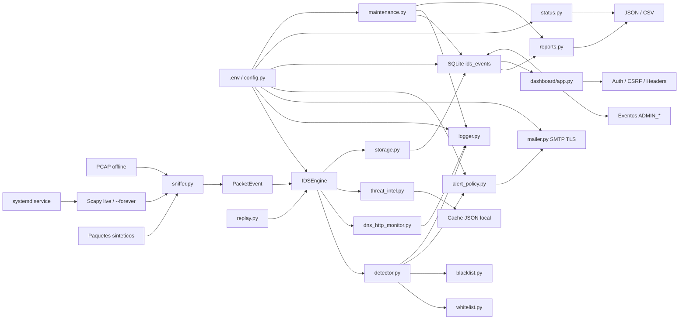

# Arquitectura - Gleipnir IDS Institucional

## Objetivo arquitectonico

Gleipnir se organiza como un IDS modular para red institucional propia. La meta
es separar captura, normalizacion, deteccion, alertas, inteligencia,
persistencia y reportes para que cada modulo pueda probarse sin depender de una
interfaz fisica real. La version 2.0 tambien contempla operacion continua con
systemd, healthcheck y mantenimiento de retencion para ejecucion 24/7.

## Vista general

## Modulos

### `src/config.py`

Carga `.env` con `python-dotenv`, valida variables obligatorias y expone una
estructura `Config`. Los secretos se excluyen de `repr` y se muestran redactados
con `as_redacted_dict()`.

Configuraciones relevantes de la version 2.0:

- `IDS_DB_PATH`
- `REPORT_DIR`
- `ALERT_COOLDOWN_SECONDS`
- `ALERT_MAX_PER_MINUTE`
- `HEALTH_LOG_INTERVAL_SECONDS`
- `EVENT_RETENTION_DAYS`
- `MAX_LOG_SIZE_MB`
- `MAX_REPORTS_TO_KEEP`
- `GLEIPNIR_INTERFACE`
- `GLEIPNIR_MODE`
- API keys opcionales para AbuseIPDB y VirusTotal.
- Variables del dashboard: `DASHBOARD_AUTH_ENABLED`,
  `DASHBOARD_SECRET_KEY`, `DASHBOARD_ROLE`,
  `DASHBOARD_SESSION_COOKIE_SECURE` y
  `DASHBOARD_SESSION_TIMEOUT_MINUTES`.

### `src/logger.py`

Configura logging en consola y archivo con rotacion por tamano. El tamano se
controla con `MAX_LOG_SIZE_MB`. Aplica redaccion defensiva de campos como
password, token, secret y API keys.

### `src/whitelist.py`

Lee `data/whitelist.csv` con columnas `ip,mac,description`. Valida IPv4, IPv6 y
MAC. Expone `load_whitelist()` e `is_authorized(ip, mac)`.

### `src/blacklist.py`

Lee `data/blacklist.txt`, una IP por linea. Valida IPv4 e IPv6. Expone
`load_blacklist()`, `is_blacklisted(ip)` y funciones administrativas usadas por
la CLI.

### `src/sniffer.py`

Normaliza paquetes en `PacketEvent`. Soporta:

- Paquetes sinteticos.
- PCAP offline.
- Tramas Ethernet IPv4/IPv6.
- Paquetes compatibles con Scapy.
- Captura live con Scapy mediante `start_live_capture()`.
- Captura live supervisada mediante `start_live_capture_forever()`.

La captura live no se ejecuta automaticamente; debe invocarse de forma explicita.
El modo `--forever` esta pensado para systemd: reintenta errores recuperables,
mantiene contadores y registra `LIVE_CAPTURE_HEALTH` cada
`HEALTH_LOG_INTERVAL_SECONDS`.

### `src/detector.py`

Produce eventos de identidad:

- `AUTHORIZED_DEVICE`.
- `UNAUTHORIZED_DEVICE`.

Tambien detecta destinos externos en lista negra:

- `BLACKLISTED_EXTERNAL_IP`.

Integra lista blanca, lista negra, logger y mailer.
Antes de llamar al mailer, el flujo normal puede pasar por `alert_policy.py`
para evitar correos repetidos.

### `src/alert_policy.py`

Agrupa alertas repetidas y decide si un correo debe enviarse o suprimirse.
Usa severidades `low`, `medium`, `high` y `critical`. La severidad critica no
se bloquea por cooldown ni por limite por minuto.

### `src/dns_http_monitor.py`

Registra metadatos DNS y HTTP cuando estan disponibles. No descifra HTTPS. Puede
trabajar con paquetes sinteticos, `PacketEvent` y paquetes Scapy simulados.

### `src/mailer.py`

Envia alertas SMTP con TLS. Usa configuracion de `.env` por medio de
`config.py`. Las pruebas usan mocks para evitar correos reales.

### `src/threat_intel.py`

Consulta AbuseIPDB, VirusTotal y Whois para IPs externas. Tiene cache JSON,
timeout, manejo de rate limit y tolerancia a fallos.

El orquestador solo lo invoca cuando existe una IP externa relevante o un evento
`BLACKLISTED_EXTERNAL_IP`; no consulta APIs para todo el trafico.

### `src/replay.py`

Reproduce PCAPs como simulacion temporal. Envia `PacketEvent` a `IDSEngine`,
manteniendo el modo offline sin abrir interfaces de red.

### `src/runtime/engine.py`

Contiene `IDSEngine`, el orquestador central. Carga listas validadas, configura
logging, conecta detector, monitor DNS/HTTP, blacklist, threat intelligence,
politicas de alerta y almacenamiento SQLite. Sus metodos principales son:

- `IDSEngine.from_config()`
- `process_packet_event(event)`
- `process_dns_http_event(event)`
- `shutdown()`

### `src/storage.py`

Crea y usa una base SQLite local en `IDS_DB_PATH`. La tabla `ids_events` guarda
eventos normalizados y un `raw_json` sanitizado. Eventos persistidos:

- `AUTHORIZED_DEVICE`
- `UNAUTHORIZED_DEVICE`
- `DNS_EVENT`
- `HTTP_EVENT`
- `BLACKLISTED_EXTERNAL_IP`
- `THREAT_INTEL_RESULT`
- `ALERT_SENT`
- `ALERT_SUPPRESSED`
- `ADMIN_LOGIN_SUCCESS`
- `ADMIN_LOGIN_FAILED`
- `ADMIN_LOGOUT`
- `ADMIN_WHITELIST_ADD`
- `ADMIN_WHITELIST_REMOVE`
- `ADMIN_BLACKLIST_ADD`
- `ADMIN_BLACKLIST_REMOVE`

### `src/dashboard/app.py`

Expone el dashboard web local con Flask. Lee eventos desde SQLite, muestra
resumenes, filtros, graficas simples y detalle de eventos. Las vistas de eventos
son de solo lectura. La seccion `/admin/lists` permite administrar whitelist y
blacklist solo con rol `admin`.

Controles del dashboard:

- Host por defecto `127.0.0.1`.
- `0.0.0.0` solo desde CLI con `--allow-lan`.
- Login con sesion cuando `DASHBOARD_AUTH_ENABLED=true`.
- Roles `viewer` y `admin`.
- Tokens CSRF en formularios administrativos.
- Expiracion de sesion por `DASHBOARD_SESSION_TIMEOUT_MINUTES`.
- Cookies `HttpOnly`, `SameSite=Lax` y `Secure` configurable.
- Cabeceras `X-Content-Type-Options`, `X-Frame-Options`,
  `Referrer-Policy`, `Cache-Control` y CSP basica.
- Auditoria `ADMIN_*` en SQLite o logger sin contrasenas, tokens ni secretos.

Para produccion real, Flask debe quedar detras de Nginx/Caddy escuchando en
`127.0.0.1`, con TLS terminado en el reverse proxy.

### `src/reports.py`

Genera reportes JSON y CSV desde eventos acumulados en SQLite. Redacta campos
sensibles y soporta filtros por formato, tipo, fechas, IP origen, dominio y
severidad.

### `src/status.py`

Ejecuta el healthcheck `gleipnir status`. Verifica carga de configuracion,
existencia de whitelist/blacklist, acceso a `LOG_DIR`, acceso a `REPORT_DIR` si
existe, SQLite si ya fue creada, disponibilidad SMTP sin enviar correo real y
la interfaz definida por `GLEIPNIR_INTERFACE`.

### `src/maintenance.py`

Aplica politicas de retencion con `gleipnir maintenance`. Elimina eventos
antiguos de SQLite, conserva solo los ultimos reportes y valida que el logger
use rotacion por tamano. No borra datos fuera de las rutas configuradas.

### `src/cli.py`

Interfaz de linea de comandos con `argparse`. Expone:

- `gleipnir offline`
- `gleipnir replay`
- `gleipnir live`
- `gleipnir live --interface <interfaz> --forever`
- `gleipnir report`
- `gleipnir test-config`
- `gleipnir status`
- `gleipnir maintenance`
- `gleipnir whitelist ...`
- `gleipnir blacklist ...`
- `gleipnir dashboard --host 127.0.0.1 --port 8080`
- `gleipnir dashboard --host 0.0.0.0 --port 8080 --allow-lan`

### `deploy/systemd/gleipnir.service`

Plantilla de servicio para Ubuntu 24.04 LTS. Ejecuta Gleipnir desde
`/opt/gleipnir`, carga `/opt/gleipnir/.env` y usa
`gleipnir live --interface <INTERFAZ> --forever` con `Restart=always`.

## Flujo de datos

1. La configuracion se carga desde `.env`.
2. `replay` o `live` entregan paquetes normalizados a `IDSEngine`.
3. El sniffer convierte paquetes a `PacketEvent`.
4. El detector compara origen IP/MAC contra whitelist.
5. El detector compara destino externo contra blacklist.
6. El monitor DNS/HTTP extrae dominios, host, metodo y ruta si existen.
7. Threat intelligence puede enriquecer IPs externas relevantes.
8. La politica de alerta decide si se envia o suprime correo.
9. Logger registra eventos y errores sin secretos.
10. SQLite guarda eventos acumulados.
11. Reports genera JSON/CSV filtrados desde SQLite.
12. Status valida la salud local sin enviar correos reales.
13. Maintenance aplica retencion de eventos, reportes y logs.
14. Dashboard lee SQLite y registra auditoria administrativa `ADMIN_*`.

## Superficie defensiva

El proyecto esta limitado a observacion y analisis defensivo. No incluye:

- Ataques.
- Spoofing.
- Explotacion.
- Evasion.
- Descifrado de trafico cifrado.
- Captura fuera de redes propias o sin autorizacion.
- Exposicion publica deliberada del dashboard sin HTTPS ni autenticacion.

## Modos operativos

### Offline

Lee PCAP y normaliza eventos. No abre interfaces.

### Replay

Lee PCAP y simula trafico con delay opcional.

### Live

Usa Scapy para capturar ARP, IPv4 e IPv6 desde una interfaz seleccionada.
Requiere permisos de captura en Linux.

### Live --forever

Usa ciclos de captura supervisados para ejecucion 24/7. Reintenta errores
temporales de captura con pausa entre intentos, registra errores recuperables,
mantiene contadores y emite logs periodicos. Los errores criticos de permisos,
interfaz invalida o dependencia ausente no se ocultan.
